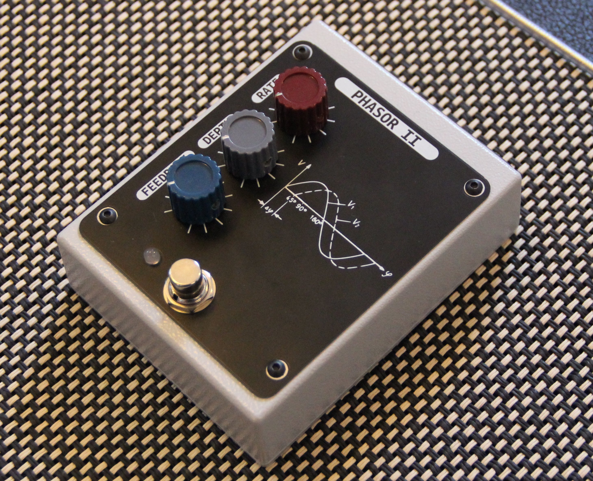
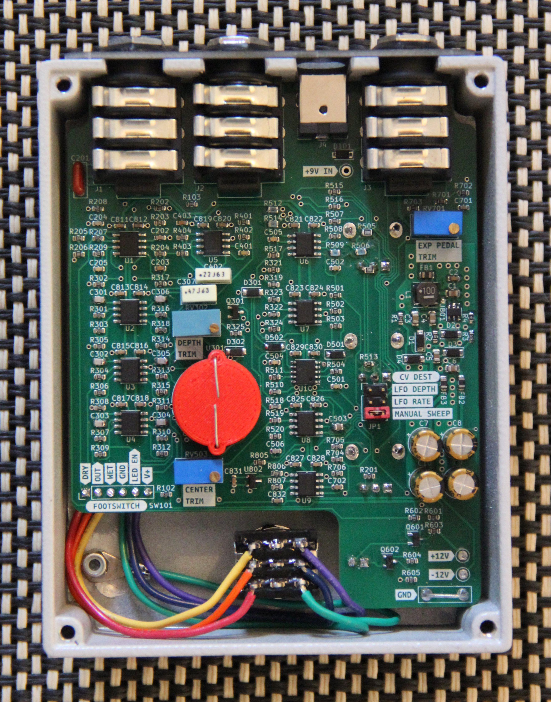

# Phasor II Guitar Pedal

## 6-stage optical phase shifter pedal ala the Mu-tron II with extra features

- Fits in a Hammond BB style box
- Classic `RATE`, `DEPTH`, and `FEEDBACK` controls
- Powered by a standard guitar pedal style center-negative 9VDC power supply
- Expression pedal/CV input jack
    - Connect a Moog EP-3 or similar expression pedal with a TRS cable
    - Or inject a Control Voltage in the range [0v, +5v] with a TS cable
    - An internal jumper selects the destination for the modulation
        - `LFO DEPTH`
        - `LFO RATE`
        - `MANUAL SWEEP`

## [SCHEMATIC](https://github.com/JordanAceto/Phasor_II/blob/main/main_pcb/docs/phasor_II-schematic.pdf)

---

---

## Calibration
### There are three points of calibration via internal trimpots
- `EXP PEDAL TRIM`
    - Connect a Moog EP-3 or similar expression pedal to the `CV-PED` jack and power the pedal ON
    - Make sure that any built in attenuators on the expression pedal are turned all the way up
    - With a multimeter set to DC volts measure the TIP of the `CV-PED` jack relative to ground (there is a convenient place to clip the black lead of the multimeter on the pcb)
    - Sweep the expression pedal all the way forwards, and adjust the `EXP PEDAL TRIM` trimpot until you measure +5VDC
    - Sweep the expression pedal back and forth and observe that the tip of the `CV-PED` jack sweeps from 0v to +5v
    
- `DEPTH TRIM`
    - This sets the width of the phasor sweep
    - Adjust by ear so that the sweep width is pleasant

- `CENTER TRIM`
    - This sets the center of the phasor sweep
    - Adjust by ear so that the bottom "turn around" feels good

- The depth and center trims are somewhat interactive, and should be trimmed together iteratively. Try a variety of rate and depth settings while calibrating.

- Note that while there is a light shield covering the photocells, ambient light will slightly change the sweep when the back panel is off
    - Perform calibration in a dim room. It doesn't need to be pitch black, just avoid shining bright lights right onto the guts

### There are no wrong or harmful settings, adjust these to taste. If the expression pedal feels better to you with a different voltage across it, go nuts.

---

## Current consumed from the 9VDC power input
### 9VDC    :   200mA

---

## Status of the project:

Task | Status |
---------|--------------|
Schematic capture | &#9745;
PCB layout | &#9745;
Test build | &#9745;
Safe to order boards| &#9745;