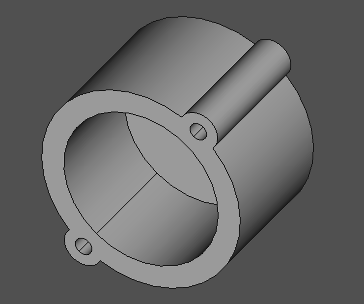

# 3D printed light shield

- Blocks ambient light from shining on the Light Dependent Resistor ring
- Attaches to the main PCB by soldering wire scraps through the holes and bending them over
- Available as a FreeCAD project and `.stl` file

